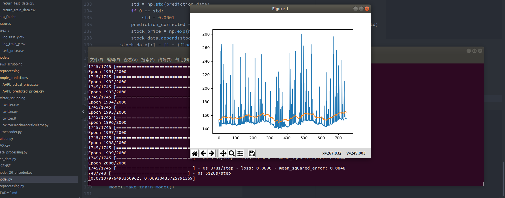

# 股市预测模型

这个模型是[VivekPa:AIAlpha](https://github.com/VivekPa/AIAlpha) 的，我拿过来修改成 Tensorflow 实现，并重新调试。

    python preprocessing.py

是进行小波变换，数据预处理过滤噪声用的。

    python autoencoder.py

是利用编码解码器进行数据维度压缩用的。

    python data_processing.py

用来拆分数据，拆成训练集和测试集。

    python model.py

构造 LSTM 模型，训练并预测数据用。

按照上面几个脚本的顺序执行可以重现实验结果：

## 文件

`stock_data.csv`：训练用数据。`preprocessing/indicators.csv`，未经过降噪的数据后半段相对于前半段变化的幅度。`preprocessing/log_train.csv`降噪后的数据，这个降噪是单独对拆分的小数据片段进行降噪，而不是在整个数据集上统一进行的降噪。`preprocessing/rbm_train.csv`和`preprocessing/rbm_test.csv`都是从`preprocessing/log_train.csv`中拆一部分出来的。`preprocessing/test_data.csv`原始数据里面拿小片段第5列最后一个数据，跟倒数前一个数据差分对数后的结果。`preprocessing/test_stock.csv`直接取原始数据第5列。`stock_data_test.csv`从`preprocessing/test_stock.csv`里拆开的一部分。

编码器是使用`preprocessing/rbm_train.csv`训练的。训练完成后对`preprocessing/log_train.csv`进行编码，保存为`features/autoencoded_data.csv`。

然后从`features/autoencoded_data.csv`中拆分出`features/autoencoded_test_data.csv`和`features/autoencoded_train_data.csv`。再从`preprocessing/test_data.csv`中拆分`features/autoencoded_train_y.csv`和`features/autoencoded_test_y.csv`。

LSTM 的训练是以`features/autoencoded_train_data.csv`作为输入，`features/autoencoded_train_y.csv`作为输出进行的。训练完成后有根据`features/autoencoded_test_data.csv`和`features/autoencoded_test_y.csv`评估拟合程度。数据的预测上，